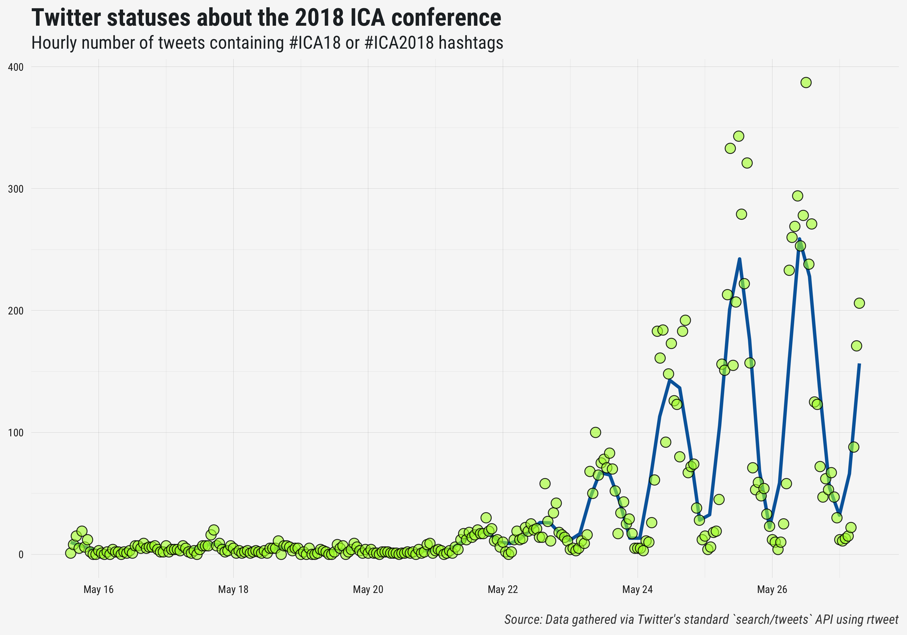

<!-- README.md is generated from README.Rmd. Please edit that file -->

# ica18

How to collect \[and update\] data.

``` r
## load rtweet
library(rtweet)

## read data
if (file.exists(file.path("data", "ica18.rds"))) {
  ica_old <- readRDS(file.path("data", "ica18.rds"))
  sinceid <- ica_old$status_id[order(ica_old$created_at, decreasing = TRUE)[1]]
} else {
  sinceid <- NULL
}

## get ICA18 tweets
ica <- search_tweets("ica18 OR ica2018", n = 18000, since_id = sinceid)
#> Searching for tweets...
#> This may take a few seconds...
#> Finished collecting tweets!

## merge if updating
if (exists("ica_old")) {
  ## merge data
  ica <- rbind(ica, ica_old)
  
  ## rm ica2
  rm(ica_old)

  ## filter unique data
  ica <- funique::funique(ica)
}

## save data set
saveRDS(ica, file.path("data", "ica18.rds"))

## view data
ica
#> # A tibble: 11,084 x 87
#>    user_id status_id created_at          screen_name text  source display_text_wi… reply_to_status…
#>    <chr>   <chr>     <dttm>              <chr>       <chr> <chr>             <dbl> <chr>           
#>  1 576450… 10006535… 2018-05-27 08:22:50 MichelWalr… Lies… Twitt…             146. <NA>            
#>  2 983366… 10006536… 2018-05-27 08:23:13 ICASECAC    When… Twitt…             109. <NA>            
#>  3 104920… 10006534… 2018-05-27 08:22:35 wishcrys    RT @… Twitt…             140. <NA>            
#>  4 104920… 10006533… 2018-05-27 08:22:09 wishcrys    RT @… Twitt…             140. <NA>            
#>  5 116016… 10006532… 2018-05-27 08:21:40 poli_com    RT @… Twitt…             140. <NA>            
#>  6 116016… 10006532… 2018-05-27 08:21:32 poli_com    RT @… Twitt…             140. <NA>            
#>  7 116016… 10006532… 2018-05-27 08:21:46 poli_com    RT @… Twitt…             144. <NA>            
#>  8 116016… 10006531… 2018-05-27 08:21:24 poli_com    RT @… Twitt…             140. <NA>            
#>  9 116016… 10006531… 2018-05-27 08:21:21 poli_com    RT @… Twitt…             108. <NA>            
#> 10 132089… 10006534… 2018-05-27 08:22:31 FHeinderyc… "The… Tweet…             256. <NA>            
#> # ... with 11,074 more rows, and 79 more variables: reply_to_user_id <chr>,
#> #   reply_to_screen_name <chr>, is_quote <lgl>, is_retweet <lgl>, favorite_count <int>,
#> #   retweet_count <int>, hashtags <list>, symbols <list>, urls_url <list>, urls_t.co <list>,
#> #   urls_expanded_url <list>, media_url <list>, media_t.co <list>, media_expanded_url <list>,
#> #   media_type <list>, ext_media_url <list>, ext_media_t.co <list>, ext_media_expanded_url <list>,
#> #   ext_media_type <chr>, mentions_user_id <list>, mentions_screen_name <list>, lang <chr>,
#> #   quoted_status_id <chr>, quoted_text <chr>, quoted_created_at <dttm>, quoted_source <chr>,
#> #   quoted_favorite_count <int>, quoted_retweet_count <int>, quoted_user_id <chr>,
#> #   quoted_screen_name <chr>, quoted_name <chr>, quoted_followers_count <int>,
#> #   quoted_friends_count <int>, quoted_statuses_count <int>, quoted_location <chr>,
#> #   quoted_description <chr>, quoted_verified <lgl>, retweet_status_id <chr>, retweet_text <chr>,
#> #   retweet_created_at <dttm>, retweet_source <chr>, retweet_favorite_count <int>,
#> #   retweet_retweet_count <int>, retweet_user_id <chr>, retweet_screen_name <chr>,
#> #   retweet_name <chr>, retweet_followers_count <int>, retweet_friends_count <int>,
#> #   retweet_statuses_count <int>, retweet_location <chr>, retweet_description <chr>,
#> #   retweet_verified <lgl>, place_url <chr>, place_name <chr>, place_full_name <chr>,
#> #   place_type <chr>, country <chr>, country_code <chr>, geo_coords <list>, coords_coords <list>,
#> #   bbox_coords <list>, name <chr>, location <chr>, description <chr>, url <chr>, protected <lgl>,
#> #   followers_count <int>, friends_count <int>, listed_count <int>, statuses_count <int>,
#> #   favourites_count <int>, account_created_at <dttm>, verified <lgl>, profile_url <chr>,
#> #   profile_expanded_url <chr>, account_lang <chr>, profile_banner_url <chr>,
#> #   profile_background_url <chr>, profile_image_url <chr>
```

## Tweet frequency

See the source code [here](time_series.R)

``` r
source("time_series.R")
```

<p align="center">



</p>

 

## Semantic network

See the source code [here](network_analysis.R)

``` r
source("network_analysis.R")
```

<p align="center">


</p>

 

``` r
source("division_hashtags.R")
#> Searching for tweets...
#> This may take a few seconds...
#> Finished collecting tweets!
#> Searching for tweets...
#> This may take a few seconds...
#> Finished collecting tweets!
#> `geom_smooth()` using method = 'loess'
```

<p align="center">


</p>

``` r
## read freq table for div hashtags
icall <- readr::read_csv("freq.csv")
#> Parsed with column specification:
#> cols(
#>   hashtag = col_character(),
#>   n = col_integer()
#> )

## print freq table
knitr::kable(icall)
```

| hashtag    |   n |
| :--------- | --: |
| ica\_pol   | 366 |
| ica\_jsd   | 278 |
| ica\_cat   | 173 |
| ica\_gs    | 135 |
| ica\_cam   | 116 |
| ica\_lgbtq | 109 |
| ica\_lsi   |  78 |
| ica\_pr    |  69 |
| ica\_acsj  |  43 |
| ica\_fsd   |  43 |
| ica\_mob   |  41 |
| ica\_cm    |  37 |
| ica\_pd    |  29 |
| ica\_hc    |  27 |
| ica\_vis   |  25 |
| ica\_clp   |  24 |
| ica\_pop   |  23 |
| ica\_gcsc  |  20 |
| ica\_ptc   |  19 |
| ica\_eric  |  14 |
| ica\_is    |  12 |
| ica\_org   |  11 |
| ica\_mass  |  10 |
| ica\_icd   |   8 |
| ica\_idd   |   4 |
| ica\_mis   |   4 |
| ica\_csab  |   3 |
| ica\_env   |   3 |
| ica\_igc   |   3 |
| ica\_his   |   1 |
| ica\_sc    |   1 |
| ica\_secac |   1 |
